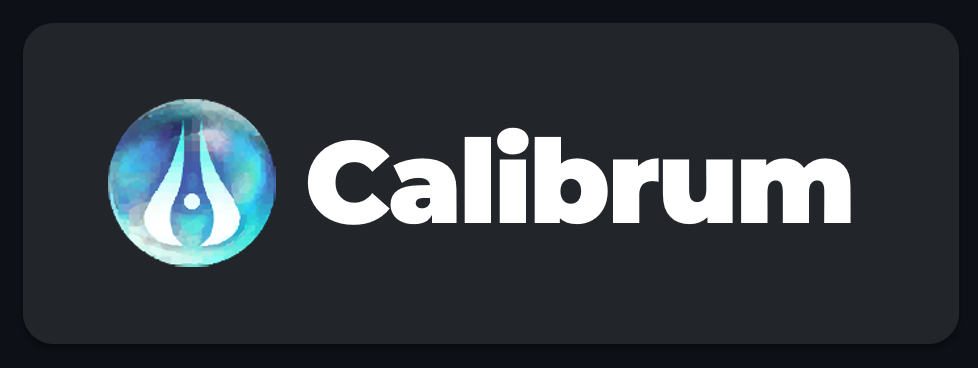
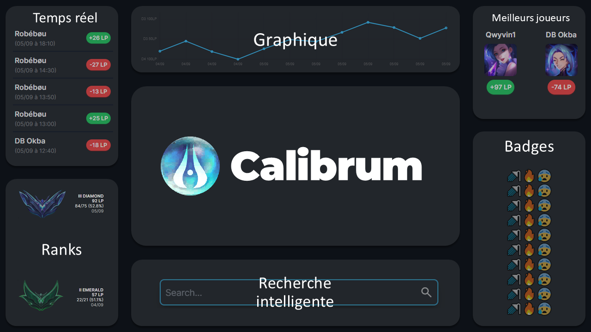

 

  <picture>
    
  </picture>

 

<h1 align="center">League of Legends SoloQ Tracker</h1>

A ranked tracker for 4eSport players.

 

    <a href="">Documentation</a>
    ·
    <a href="">Report Bug</a>
    ·
    <a href="">Request Feature</a>
    ·
    <a href="">Twitter</a>
  

## Highlights

- 🚀 Monitor your solo queue performance with real-time updates and statistics.
- ⚡️ Visualize your progress over time with detailed graphs and charts.
- 🛠️ Get insights into potential future rankings based on your current performance and trends.
- 🔥 Earn and display badges (emoji-based) that reflect your playing trends and achievements.

Calibrum is and maintained cby Mateleo & Turdyo

## Activity

